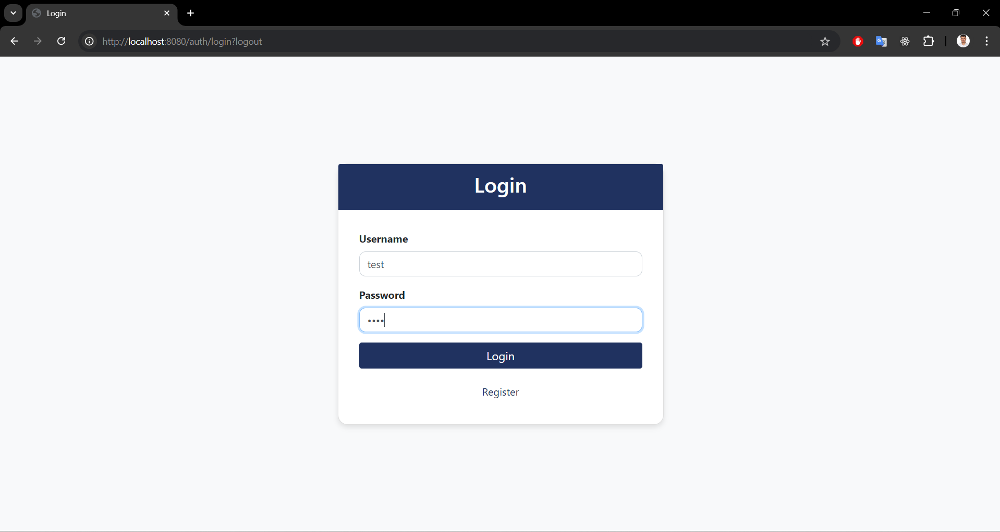
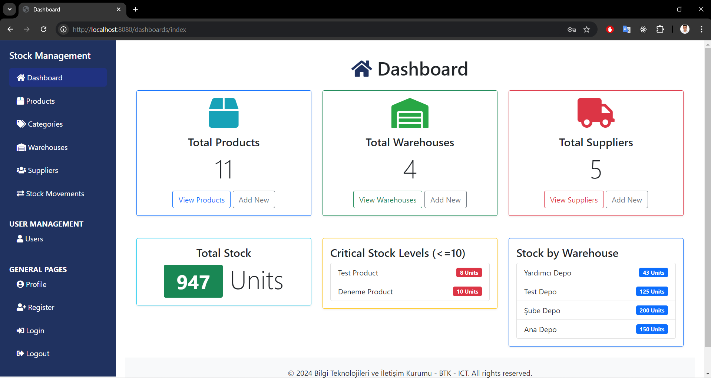
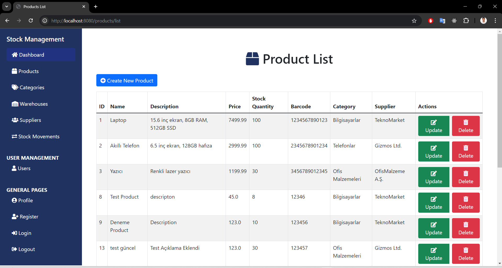
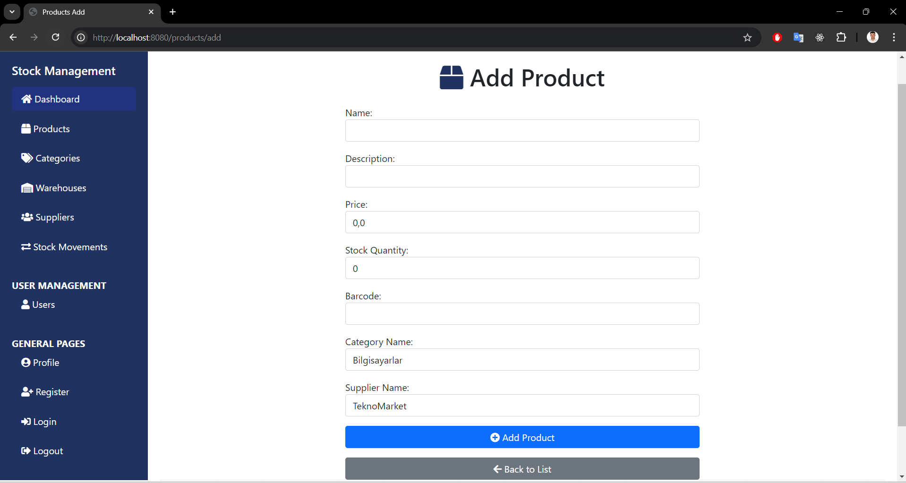
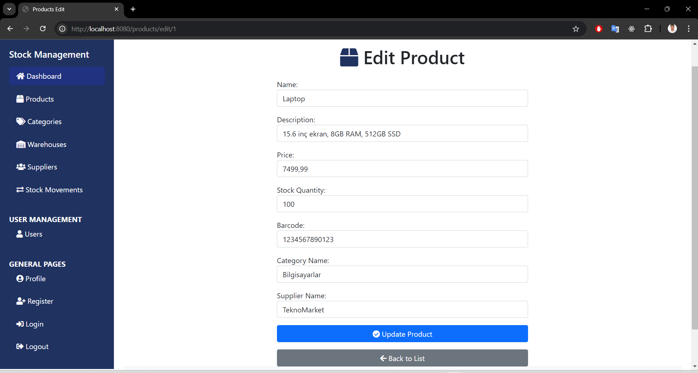
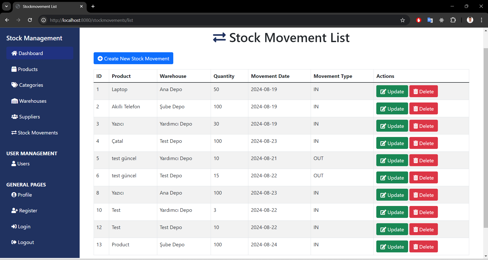
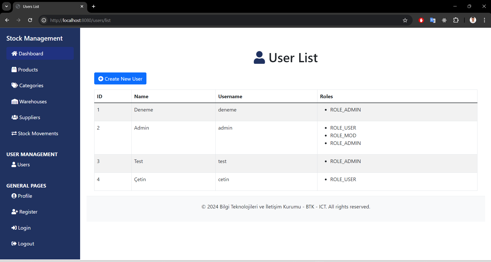
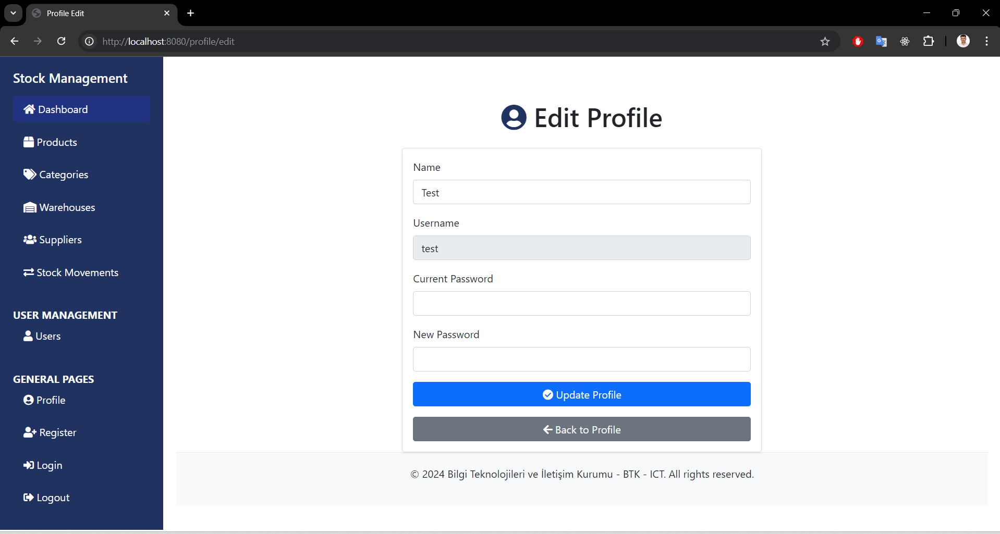
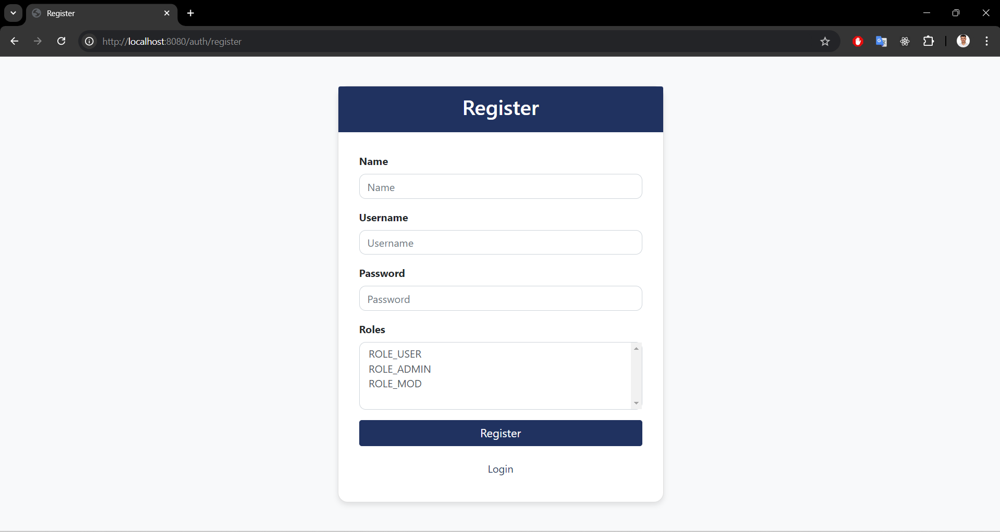

# StockManagementJava Project

## Overview

`StockManagementJava` is a comprehensive Java-based stock management system utilizing Hibernate ORM and JPA (Java Persistence API). This project encompasses various functionalities to manage stock data effectively and securely. It integrates essential CRUD operations for core entities such as `Product`, `Supplier`, `Warehouse`, and `StockMovement`.

The project features user registration, role-based access control, and JWT-based authentication to ensure secure interactions. Additionally, it uses Thymeleaf for server-side rendering of web pages and Bootstrap for modern and responsive UI design.

## Features

- **Entity Management**: Efficiently manages core entities (`Product`, `Supplier`, `Warehouse`, `Category`, `StockMovement`) with CRUD operations.

- **Security Integration**: Implements user registration and authentication using JWT, with role-based access control to secure endpoints.

- **Role-Based Access Control:**: Differentiates user access based on roles, with secure endpoints and user-specific permissions.

- **User Interface**: Utilizes Thymeleaf for server-side rendering of web pages, integrating Bootstrap for responsive and modern UI design.

- **Modular Architecture:**: Organizes the project into core, repository, service, and web modules for improved manageability and scalability.

## Getting Started

### Prerequisites

- Java 17 or higher
- Maven
- Spring Boot
- Hibernate
- JPA
- An RDBMS (e.g., MySQL, PostgreSQL)

### Installation

1. Clone the repository:

   ```bash
   git clone https://github.com/cetinyazici/StockManagementJava.git
   ```

2. Navigate to the project directory:
   ```bash
   cd StockManagement
   ```
3. Install the project dependencies using Maven:
   ```bash
   mvn clean install
   ```
4. Configure the application properties:
   Edit the src/main/resources/application.properties file to include your database configuration:
   ```bash
   spring.datasource.url=jdbc:mysql://localhost:3306/yourdatabase
   spring.datasource.username=yourusername
   spring.datasource.password=yourpassword
   spring.jpa.hibernate.ddl-auto=update
   jwt.key=yourkey
   ```
5. Run the application:

   ```bash
   mvn spring-boot:run

   ```

### Project images











### Project Summary

`StockManagementJava` is a well-rounded project designed to manage stock data with an emphasis on security and user roles. It showcases the implementation of core functionalities, including user authentication, role-based access control, and secure CRUD operations. By leveraging Hibernate, JPA, and Thymeleaf, the project provides a robust, scalable solution for stock management, making it a valuable tool for both educational and practical applications.

### Contact

- E-posta: cetin.yazici2525@gmail.com
- LinkedIn: [cetinyazici](https://www.linkedin.com/in/cetinyazici)
- GitHub: [cetinyazici](https://github.com/cetinyazici)
